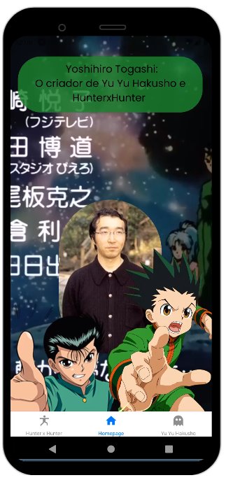

app para usar aquelas barrinhas de navegação lá embaixo ara a aula de React-Native. Escolhi esse tema pois são dois animes muito bons feitos pelo mesmo cara. 

  <h3>Att: coloquei na Google Play o app, mas as imagens saíram todas cagadas. vou prestar melhor atenção na próxima</h3>
  

  

  <h3>Página Inicial - Tem um vídeo de fundo tocando a Homework ga owaranai (primeira ending do yu yu hakusho). Se trocar de página, o vídeo e o áudio são pausados</h3>
  

  

  <h3>Página do Hunter x Hunter. Tem a sinopse e os personagens principais (só os protagonistas)</h3>
  

  

  <h3>Ao apertar o botão, começa o vídeo da primeira opening do Hunter x Hunter, a DEPARTURE.</h3>
  

  

  <h3>Página do Yu Yu Hakusho. Tem a sinopse e os personagens principais (só os protagonistas)</h3>
  

  

  <h3>Ao apertar o botão, começa o vídeo da primeira opening do Yu Yu Hakusho, a Hohoemi no Bakudan ou Smile Bomb.</h3>
  

  
agora fiquem com os reclames do snack expo abaixo 

# Sample Snack app

Open the `App.js` file to start writing some code. You can preview the changes directly on your phone or tablet by scanning the **QR code** or use the iOS or Android emulators. When you're done, click **Save** and share the link!

When you're ready to see everything that Expo provides (or if you want to use your own editor) you can **Download** your project and use it with [expo cli](https://docs.expo.dev/get-started/installation/#expo-cli)).

All projects created in Snack are publicly available, so you can easily share the link to this project via link, or embed it on a web page with the `<>` button.

If you're having problems, you can tweet to us [@expo](https://twitter.com/expo) or ask in our [forums](https://forums.expo.dev/c/expo-dev-tools/61) or [Discord](https://chat.expo.dev/).

Snack is Open Source. You can find the code on the [GitHub repo](https://github.com/expo/snack).
